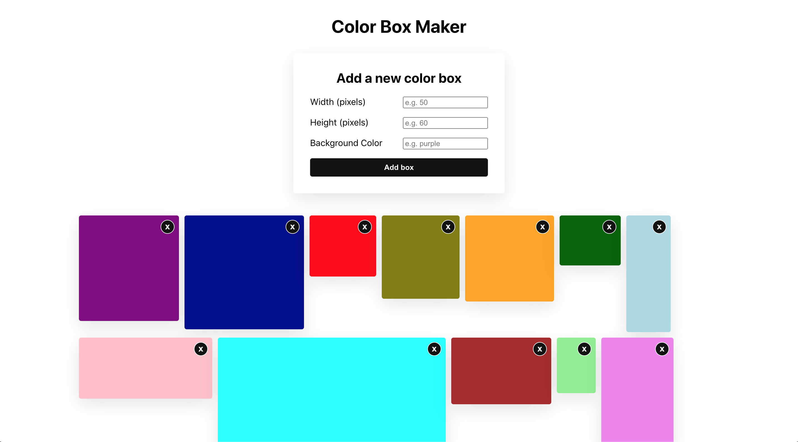

# Color Box Maker

### Description

This project aims to practice working with React forms, modifying state and passing a function down as props.

It contains the following components:

- App: this component should render the BoxList component.

- BoxList: place your state that contains all of the boxes here. This component should render all of the Box components along with the NewBoxForm component

- Box: this component should display a div with a background color, width and height based on the props passed to it.

- NewBoxForm: this component should render a form that when submitted, creates a new Box. You should be able to specify the Box’s width, height, and background color. When the form is submitted, clear the input values.

It displays an interface showing a form to add color boxes that looks like this:

### Technologies

*Languages:* Javascript, HTML, CSS

*Library:* React

### Key features

* Add a new box color with custom width, height and background color thanks to a form

* Display the color boxes created

* Delete a color box

### Poject status

The project is done.

### Credits & Sources

* Another small project from [The Modern React Bootcamp](https://www.udemy.com/course/modern-react-bootcamp)
